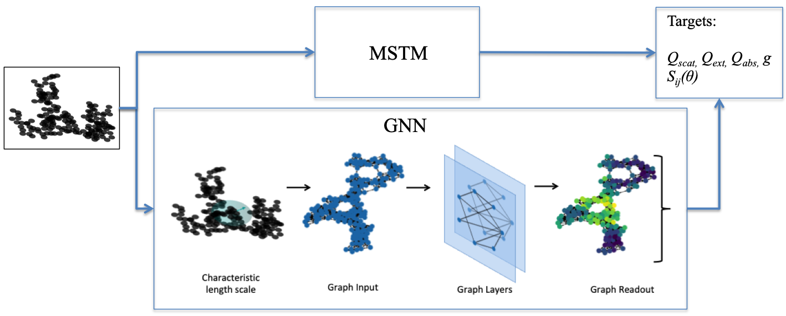

# BC-GNN
Zero-Shot Learning of Aerosol Optical Properties with Graph Neural Networks

## Overview
This repository contains a PyTorch implementation of the code for the paper "Zero-Shot learning of aerosol optical properties with graph neural networks".

## Citation

The preprint for this paper can be found at:

```
@article{Lamb2021,
  title={Zero-Shot Learning of Aerosol Optical Properties with Graph Neural Networks},
  author={Lamb, K.D. and P. Gentine},
  journal={arXiv preprint arXiv:2107.10197},
  year={2021}
}
```

## Content
- [Training Data Generation](#training-data-generation)
- [Training the Model](#training)

## Training Data Generation
Cartesian coordinates for multi-sphere clusters are generated with a cluster-cluster algorithm, which can be found at https://github.com/nmoteki/aggregate_generator 
(N. Moteki, “An efficient c++ code for generating fractal cluster of spheres (v1.1),” 2019).

Training data is generated by running the Fortran-90 implementation of the Multiple Sphere T-Matrix code (Mackowski and Mischenko, 2011). Example code for setting up batch scripts to run MSTM is given in run_mstm.py.

## Training the Model
The main training loop for the model is in the trainGCN.py script.


